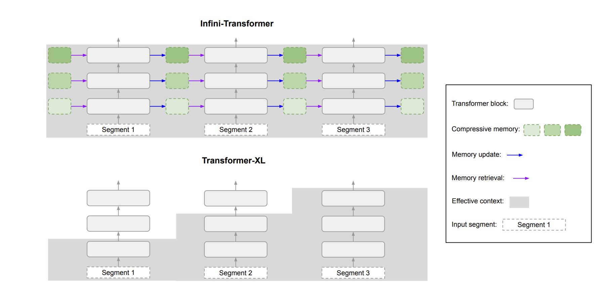
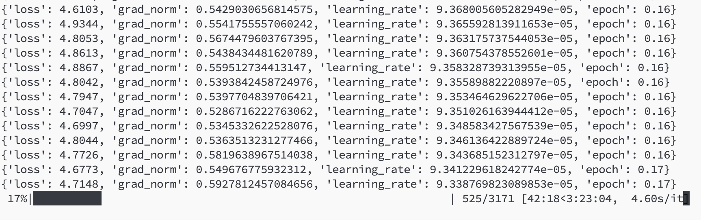
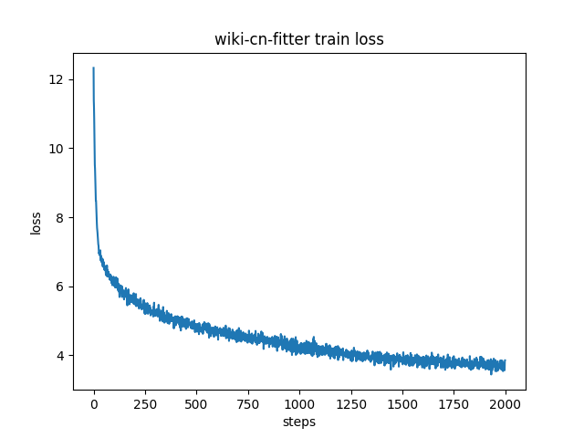

# Mini-llm
Created by Lil2J
## 📝介绍
本项目是我个人关于谷歌论文：[Leave No Context Behind: Efficient Infinite Context Transformers with Infini-attention](https://arxiv.org/pdf/2404.07143.pdf)的复现项目。

因为谷歌并没有开源其源码，所以我不能保证我的复现是100%正确的，但是我会尽力复现论文中的内容。

因为论文中没有说具体分片是在哪个步骤分片，所以我是直接在注意力阶段进行分片

这个项目的地址是gemma-2b,tokenizer使用的qwen.

目前已开源了模型代码和预训练代码，并且在进行中文维基百科的预训练。

### 目前项目的进展：

1.把Infini-attention按照论文内容加入到模型中，已正常进行前向和后向的传播。

2.使用中文维基百科数据进行预训练，能正常收敛。

### 不足之处

1.训练速度超慢，如果在每一层都使用Infini-attention，那么速度是使用正常attention的几分之一，而且显存的利用率也非常低，所以我只在模型的最后几层使用Infini-attention，其他层使用的是正常attention。谷歌官方应该会使用cuda库去加速，但是我能力有限，只能使用正常的torch算子去实现。

2.占用显存也比正常attention大很多，不过这也是正常的，毕竟多了其他参数。

3.没有跑很多数据去验证方法的有效性，因为资源有限，所以只跑了个中文维基百科数据。后续可能会去继续跑来验证代码复现的可行性。

## 使用方法

### 生成数据

首先去Wiki中文百科：[wikipedia-cn-20230720-filtered](https://huggingface.co/datasets/pleisto/wikipedia-cn-20230720-filtered) 下载数据，放入到datasets文件夹上

然后去dataset_utils下运行generate_data.py，在train_datasets下就会生成训练数据集了

### 模型代码处理

然后去按照requirements.txt安装依赖

安装完之后就把transformers库中的models/gemma/中的 modeling_gemma.py和configuration_gemma.py 替换为项目中的同名文件

### 启动训练

启动训练前可以去train.sh中看一眼参数，确认无误后。运行sh train.sh即可启动训练

## 其他
有什么问题和想一起搞大模型的可以加wx:ForeverM1LAn 进行交流

