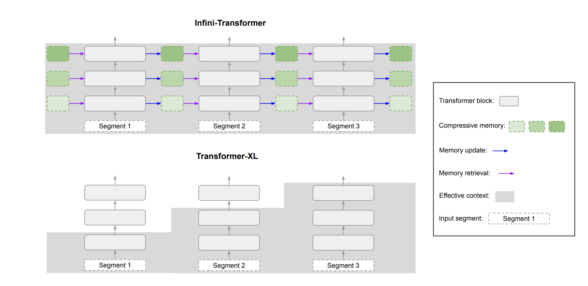
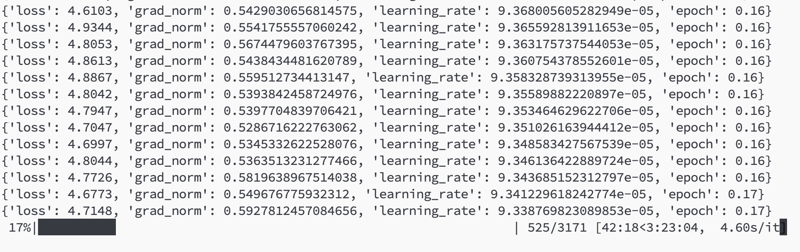
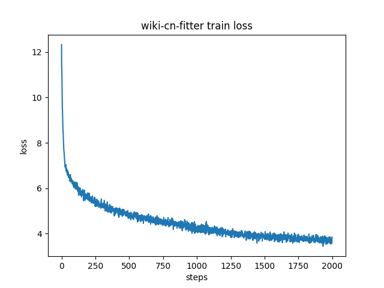

# infini-mini-transformer

Created by Lil2J
## 📝 Introduction
This project is my personal reimplementation of Google's paper: [Leave No Context Behind: Efficient Infinite Context Transformers with Infini-attention](https://arxiv.org/pdf/2404.07143.pdf).

Since Google has not open-sourced their code, I cannot guarantee that my reimplementation is 100% accurate, but I will strive to reproduce the content of the paper.

As the paper does not specify at which step segmentation should occur, I perform segmentation directly within the attention phase.

The project is hosted on gemma-2b, and the tokenizer used is qwen.

Currently, the model code and pre-training code have been open-sourced, and pre-training on Chinese Wikipedia is in progress.

### Current Progress of the Project:

1. Implemented Infini-attention into the model according to the content of the paper, and forward and backward propagation are functioning properly.

2. Pre-trained using Chinese Wikipedia data, and it converges properly.

### Limitations:

1. Training speed is extremely slow. If Infini-attention is used in every layer, the speed is only a fraction of that using normal attention, and the GPU memory utilization is also very low. Therefore, I only use Infini-attention in the final layers of the model, while other layers use normal attention. Google is likely to use the CUDA library for acceleration, but due to my limited ability, I can only use normal torch operators for implementation.

2. GPU memory usage is much higher than normal attention, but this is expected since additional parameters are involved.

3. Not much data has been run to validate the effectiveness of the method. Due to limited resources, only Chinese Wikipedia data has been run. Further validation may be conducted in the future to verify the feasibility of code reproduction.

## Usage

### Data Generation

First, download the data from Chinese Wikipedia: [wikipedia-cn-20230720-filtered](https://huggingface.co/datasets/pleisto/wikipedia-cn-20230720-filtered) and place it in the datasets folder.

Then, run generate_data.py under dataset_utils, and the training dataset will be generated in the train_datasets folder.

### Model Code Handling

Next, install dependencies according to requirements.txt.

Once installed, replace the files modeling_gemma.py and configuration_gemma.py in the models/gemma/ directory of the transformers library with the corresponding files from the project.

### Start Training

Before starting training, review the parameters in train.sh to ensure correctness. Then run sh train.sh to start training.

